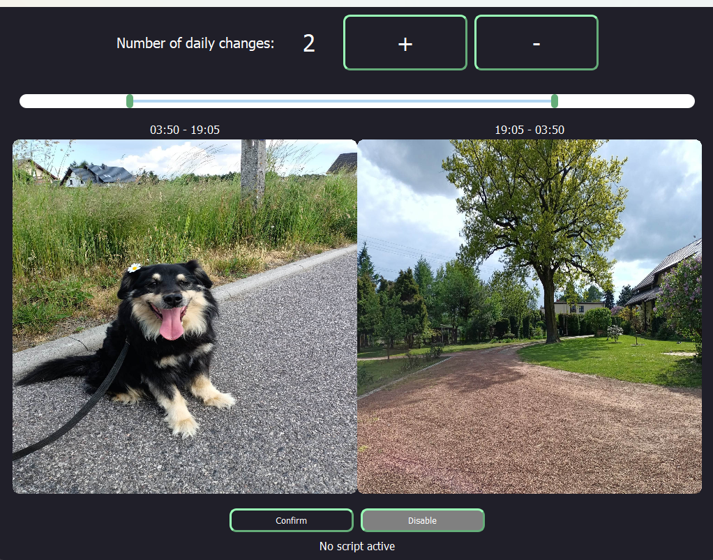

# TimedWa;;[a[er
> A windows application changing the wallpaper on a defined schedule daily

## Table of Contents
* [General Info](#general-information)
* [Technologies Used](#technologies-used)
* [Features](#features)
* [Screenshots](#screenshots)
* [Setup](#setup)
* [Usage](#usage)
* [Project Status](#project-status)
* [Room for Improvement](#room-for-improvement)
<!-- * [License](#license) -->

## General Information
- The application automates daily changing of desktop wallpaper
- Intended only for use on Windows
  - Currently tested only on Windows 11
- I created the project because I wanted my wallpaper to change with the sunlight

## Technologies Used
- Python - 3.11.1
- PyQt5 - 5.15.10
- PyInstaller - 6.4.10

## Features
Completed so far
- Graphical interface for selecting the images and times of wallpaper change
- Separate part of the program scheduling the changes and switching the wallpaper

## Screenshots
Main interface of the application

## Setup
__Using the executable files__
- To use the program via the executables download _both_ executables from the releases tab (on the right)

- Put the executables in one folder and start the program using _TimedWallpaper.exe_ file

__Using the source code__
1. Install [Python](https://www.python.org/downloads/)
2. Download the source code
3. Install the required modules by running the following command in the project folder
`pip install -r requirements.txt`
4. Run the main.py file to start the program

## Usage
The + - buttons at the top of the interface correspond to how many times you want your wallpaper to change daily.

The slider is used to adjust the times of displaying each wallpaper. Each handle corresponds to one image and decides 
when it will be set as the wallpaper. 

Once you set the correct number of breakpoints you can select the images using the buttons 
in the central part of the program. The label above each button shows the time range in which it should be active.
No buttons can be left empty.

Once you are ready click the confirm button and after a short while the second program _wallpaper_switcher.exe_ 
responsible for switching the wallpapers should start running in the background.

The _disable_ button stops the background process. 

> Currently the program stops working after restarting the system, and requires manual restart

## Project Status
Project is: _in progress_

## Room for Improvement
Ideas and TODO's are over at the [project](https://github.com/users/Filip22022/projects/3)

<!-- Optional -->
<!-- ## License -->
<!-- This project is open source and available under the [... License](). -->
